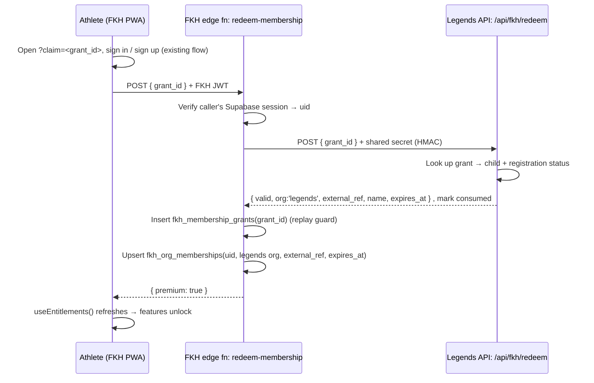

# Auth & Membership Architecture — Legends-gated Premium

**Status:** Design proposal (not yet implemented)
**Goal:** Only registered Legends athletes can access **premium** FKH features, while the public can freely **preview** the app. Built on the existing Supabase auth, and extensible to future organizations beyond Legends.

---

## 1. Where we are today (verified against code)

**FKH** — Supabase project `jjwaspyuldkwasfyrqbw`, GitHub Pages SPA (`base: /FitKidHooper/`).

- **Auth** = standard Supabase email/password wearing a "username + 6‑digit passcode" costume. `signUp({ email: recoveryEmail, password: passcode, data: { username } })`; a recovery email is **mandatory** at signup. Username→email resolution via `public.auth_usernames` + the `get_email_for_username` RPC. — `src/lib/auth.js`, `supabase/auth_usernames.sql`.
- **Identity is two-tier:** an anonymous *device* UUID (`fkh-athlete-id` in localStorage) for local‑first use, promoted to an authenticated `auth.users` id on sign‑in (`linkDeviceProfileOnAuth`, `claim_device_stats`). Every auth user auto-gets an `athlete_profiles` row via the `on_auth_user_created_profile` trigger.
- **No entitlement concept exists.** No premium / tier / subscription / role anywhere. Every training feature is open to everyone; the only distinction is *signed‑in vs anonymous* (affects sync & social identity, not access).
- **Admin is the one existing gate, and it's the pattern to copy:** `?admin=<key>` only reveals the dashboard *shell*; the real authorization is `public.admin_allowlist` + the `is_fkh_admin()` SECURITY DEFINER function used inside RLS policies (`supabase/analytics.sql`, `founder_seed.sql`). **We mirror this exact idiom for membership.**

**Legends YBA** — Supabase project `gfbpswzflmzogheotmow`, Next.js on Vercel. Deliberately a **separate** project (not merged).

- The **canonical record of a real athlete** is a `legends_registrations` row with `status='registered'` (paid programs also have `paid_at` set), linking a `legends_people` child (`role='child'`) to a `legends_programs` row. Anyone only in `legends_contacts`, or a `legends_people` child with no registration, is *just an interested lead*.
- Families already have optional Supabase Auth accounts (`legends_people.supabase_user_id`) and, more importantly, a **passwordless per‑person `portal_token`** (migration 014) that Legends already emails to guardians. Email is the soft join key across the family model.

**The core tension:** two separate Supabase projects → an FKH `auth.users.id` has *no* relationship to a `legends_people.id`. The whole design is about bridging that gap **without** merging the databases or duplicating PII.

---

## 2. Design principles

1. **Legends stays the source of truth for membership.** FKH never owns "who is a real athlete." It owns only a *derived entitlement record*, granted and revoked by Legends.
2. **Additive & local‑first preserving.** Public preview = the app almost exactly as it works today. We *add* locks to a premium subset; we don't take away the free experience. Low‑risk, Cursor‑merge‑friendly (mostly new files).
3. **Two enforcement layers, RLS is authoritative.** The client gate is UX only (lock badges, upsell). The real gate is RLS + edge functions keyed on membership — exactly like admin today.
4. **Org‑agnostic core.** Legends is *organization #1*, not a hardcoded special case. Adding a future org = one data row + one issuer adapter; FKH's gating logic never changes.
5. **No PII in URLs, no cross‑DB coupling.** Bridging is server‑to‑server with a shared secret and opaque one‑time tokens.

---

## 3. The three access levels

| Level | Who | How they get in | What they see |
|---|---|---|---|
| **Preview** | Anonymous public visitor | Nothing — open the app | Full local‑first training experience *(unchanged from today)*, with premium features shown **locked** + a "Join Legends" CTA |
| **Free account** | Signed‑in, no active membership | Username + passcode signup (as today) | Same as preview **plus** cloud sync & personal continuity across devices |
| **Premium** | Signed‑in **+ active Legends membership** | Redeem a Legends claim link / code (§5) | Everything, unlocked |

> **Boundary — CONFIRMED (founder, 2026‑07‑17): gate the social + AI layer.** All core training stays free/preview; the club social graph, Coach Agent, and Train Like Legends depth are Legends‑gated. Table below. The architecture still supports moving the line later without rework.

| Feature area | Recommended tier | Rationale |
|---|---|---|
| Exercises, workout templates, Daily Mission, shot tracker, history, progress report, badges/XP | **Preview (free)** | This is the hook that spreads the app; keep it genuinely useful (matches "the motivated kid is the champion"). |
| Cross‑device cloud sync | **Free account** | Requires an account anyway; not worth gating behind membership. |
| Leaderboards · Friends · Community feed · Messaging | **Premium** | A *real, known, safe* club roster is a feature, not a limitation — gating the social graph to verified Legends members is a safety + value win. |
| Coach Agent (AI) | **Premium** | Real per‑use cost; natural member perk. |
| Train Like Legends journeys · Challenges/quests · advanced 4‑week programs | **Premium** | The "club membership" depth. |

---

## 4. Data model (new, in the FKH project)

Three new tables + two functions, mirroring the `admin_allowlist` / `is_fkh_admin()` idiom.

```sql
-- Organizations FKH can be gated by. Legends is row #1; extensible.
create table if not exists public.fkh_organizations (
  id         uuid primary key default gen_random_uuid(),
  slug       text unique not null,          -- 'legends'
  name       text not null,                 -- 'Legends Youth Basketball'
  is_active  boolean not null default true,
  created_at timestamptz not null default now()
);

-- One row per (FKH user, org) they belong to. THE entitlement record.
create table if not exists public.fkh_org_memberships (
  id           uuid primary key default gen_random_uuid(),
  user_id      uuid not null references auth.users(id) on delete cascade,
  org_id       uuid not null references public.fkh_organizations(id) on delete cascade,
  external_ref text,                         -- legends_people.id (opaque; set by the bridge)
  role         text not null default 'athlete'   -- 'athlete' | 'guardian' | 'coach'
                 check (role in ('athlete','guardian','coach')),
  status       text not null default 'active'    -- 'active' | 'expired' | 'revoked'
                 check (status in ('active','expired','revoked')),
  granted_via  text,                         -- 'claim_link' | 'email_match' | 'staff'
  granted_at   timestamptz not null default now(),
  expires_at   timestamptz,                  -- season / program end; null = no expiry
  revoked_at   timestamptz,
  metadata     jsonb,
  unique (user_id, org_id)
);

-- Replay guard: each opaque grant can be redeemed once.
create table if not exists public.fkh_membership_grants (
  grant_id    text primary key,             -- opaque token minted by the org
  org_id      uuid not null references public.fkh_organizations(id),
  redeemed_by uuid references auth.users(id),
  redeemed_at timestamptz not null default now()
);

alter table public.fkh_organizations   enable row level security;
alter table public.fkh_org_memberships enable row level security;
alter table public.fkh_membership_grants enable row level security;

-- Users may read only their own membership rows.
create policy "memberships_self_select" on public.fkh_org_memberships
  for select using (user_id = auth.uid());
-- Writes happen only through SECURITY DEFINER edge functions (service role); no anon/user write policy.

-- The gate — mirror of is_fkh_admin(). Any active, unexpired membership in an active org.
create or replace function public.fkh_has_premium(p_uid uuid default auth.uid())
returns boolean language sql stable security definer set search_path = public as $$
  select exists (
    select 1
    from public.fkh_org_memberships m
    join public.fkh_organizations o on o.id = m.org_id
    where m.user_id = p_uid
      and m.status = 'active'
      and o.is_active
      and (m.expires_at is null or m.expires_at > now())
  );
$$;

grant execute on function public.fkh_has_premium(uuid) to authenticated;
```

**Why `expires_at` on the row:** memberships lapse automatically at season/program end even if no reconcile job runs — a returning athlete simply re‑redeems. Revocation before expiry is handled by the reconcile path (§5.3).

---

## 5. The bridge — how a Legends athlete becomes an FKH member

Because the projects are separate, bridging is **server‑to‑server with a shared secret**. Recommended path is an **opaque one‑time grant** exchanged at redeem time — this keeps PII out of URLs and keeps Legends authoritative at the moment of grant.

### 5.1 Issue (Legends side)
When a registration becomes `registered` (or from the guardian portal, a "Get the FKH app" button), Legends mints an opaque `grant_id` (random, unguessable), stores it against the `legends_people` child with a short TTL, and delivers a deep link — reusing the existing registration‑email / `portal_token` machinery:

```
https://<user>.github.io/FitKidHooper/?claim=<grant_id>
```

The `grant_id` is opaque — it carries **no** name/DOB/person_id, so nothing sensitive sits in the URL.

### 5.2 Redeem (FKH side)


- The FKH edge function (`supabase/functions/redeem-membership/`, alongside existing `coach-agent` / `send-push`) holds the shared secret and the service role; it is the only writer to `fkh_org_memberships`.
- Legends exposes one new route, `POST /api/fkh/redeem`, authenticated by the shared secret (HMAC of the body), returning the membership assertion and marking the grant consumed. Legends stays the source of truth at the decisive moment.
- Replay is blocked twice: Legends marks the grant consumed, and FKH records `grant_id` in `fkh_membership_grants`.

### 5.3 Revoke / expire
- **Passive (default):** `expires_at` = program/season end → `fkh_has_premium` returns false automatically. Re‑registration next season issues a fresh grant.
- **Active (optional):** a scheduled FKH edge function `reconcile-memberships` calls a Legends `GET /api/fkh/members` (shared‑secret) returning currently‑active `external_ref`s, and flips any FKH membership not in that set to `status='revoked'`. Add this only if immediate mid‑season revocation (refund/cancellation) is a real requirement — otherwise `expires_at` suffices.

### 5.4 Optional accelerator — email auto‑match
FKH already captures a recovery email at signup and Legends keys families by email. A lower‑assurance fast path: if the FKH recovery email matches a guardian/household email with an active registration, auto‑grant. Because a child can type any email, treat this as **convenience, not proof** — gate it behind the same server‑to‑server verification, and prefer the claim link as the primary, deterministic path. (Recommended: ship claim‑link first; add email‑match later only if onboarding friction demands it.)

### 5.5 Where the invite is sent from — all on the Legends side
FKH *redeems*; Legends *issues* (it owns the source of truth). All three surfaces live in the existing `legendsyba` app and use its secret‑key admin client:

1. **Automatic (recommended default):** the Stripe webhook that flips a registration to `registered` also mints a grant and appends the FKH claim link to the confirmation email Legends **already sends** (`app/lib/registrationEmail.ts`). Every new athlete is invited with zero manual work.
2. **Self‑serve:** a "Get the FKH app" button in the existing guardian **"My Family" portal** (`portal_token` page) — mints/shows the child's claim link on demand.
3. **Admin — manual & bulk:** a **"Send FKH Invite"** button per child on `app/admin/families` / `app/admin/registrations`, plus a **bulk "invite all registered athletes in Program X"** action. The bulk button is how you back‑fill invites to families who registered *before* this feature shipped. These admin pages already exist.

**FKH‑admin fallback:** a "manually grant membership" control in the FKH admin dashboard that writes `fkh_org_memberships` directly (the degenerate staff‑grant adapter from §7) — for one‑off edge cases only; primary issuance stays in Legends.

---

## 6. Enforcement in the app

**Client (UX layer only)** — a new `useEntitlements()` hook mirroring `useAuth()`:

```js
// src/hooks/useEntitlements.js
// returns { loading, isMember, orgs: ['legends'], isPremium }
// reads fkh_has_premium() via RPC; refetches on auth change and after redeem.
```

Premium feature entry points check `isPremium` to render either the feature or a `<LockedFeature org="legends" />` upsell ("Join Legends Youth Basketball to unlock friends, leaderboards & your coach"). This is purely cosmetic — it must never be the only gate.

**Server (authoritative)** — for every premium *data* surface, RLS policies and edge functions call `fkh_has_premium(auth.uid())`, exactly as analytics tables call `is_fkh_admin()` today. E.g. gating writes to `messages`, `feed_comments`, `challenges`, and the `coach-agent` edge function. A user who bypasses the client still hits a wall at the database.

> Note: several social tables currently ship permissive `using (true)` RLS (leaderboard/profile "MVP" policies). Tightening those to `fkh_has_premium()` for premium surfaces is part of implementation, and should be done carefully to avoid breaking the free/preview experience.

---

## 7. Extending to future organizations

The core is org‑agnostic, so onboarding org #2 is bounded work:

1. `insert into fkh_organizations (slug, name) values ('<slug>', '<name>');`
2. Build that org's **issuer adapter**: a way to mint opaque grants + a `/redeem` and (optional) `/members` endpoint honoring the shared‑secret contract. (For an org without its own backend, "staff grant" via an admin tool writing `fkh_org_memberships` directly is a valid degenerate adapter.)
3. Nothing in FKH's gating (`fkh_has_premium`, `useEntitlements`, RLS) changes — a member of *any* active org is premium. If per‑org differentiated features are ever needed, branch on `metadata.orgSlug` from `fkh_member_orgs()`; not needed for launch.

### 7.1 Grandfathering existing users (required at launch)
Existing FKH users pre‑date the gate and **must not** be locked out. This is org #2, not special‑case code: add a `founding-members` organization and back‑fill a lifetime membership for every account that exists at launch. `fkh_has_premium()` is unchanged — a founding member and a Legends athlete both just have an active row.

```sql
insert into public.fkh_organizations (slug, name)
values ('founding-members', 'FKH Founding Members');

insert into public.fkh_org_memberships (user_id, org_id, role, status, granted_via, expires_at)
select u.id, o.id, 'athlete', 'active', 'grandfather', null   -- null = never expires
from auth.users u
cross join public.fkh_organizations o
where o.slug = 'founding-members'
  and u.created_at <= '<LAUNCH_TS>'
on conflict (user_id, org_id) do nothing;
```

**Caveat — anonymous/device users have no `auth.users` row**, so they can't be back‑filled directly. To cover active kids who haven't created an account yet, extend the cutoff a few weeks *past* launch (grandfather any account created before `<LAUNCH_TS + N weeks>`) so they're covered when they convert. This backfill runs as the last step of Phase 2, right before locks turn on.

### 7.2 Subscriptions (future) — already accommodated
A paid subscription is just another **grant source** writing the *same* `fkh_org_memberships` table; the gate doesn't care *why* someone is a member:

| Source | `granted_via` | `expires_at` maintained by |
|---|---|---|
| Legends athlete | `claim_link` | season / program end |
| Existing user | `grandfather` | never (lifetime) |
| **Paid subscriber** | `stripe_subscription` | **Stripe webhook — current period end** |

- Model direct subscribers as their own org, e.g. `fkh-individual`.
- `invoice.paid` → push `expires_at` forward; `customer.subscription.deleted` → `status='revoked'`. Same row shape, so `fkh_has_premium()`, `useEntitlements()`, and every RLS policy stay **byte‑for‑byte identical**.
- The Stripe integration already wired into `legendsyba` is the natural home for this webhook — no new payment stack (matches the donations‑now / subscriptions‑later‑on‑demand direction).
- Tiers (free / premium / pro) later: add a `plan` column or use `metadata` jsonb; the gate can branch on it. Not needed now.

---

## 8. Security notes

- **Shared secret** lives only in edge‑function / server secrets on both sides (Supabase function secrets; Vercel env). Never in the SPA bundle (which is public on GitHub Pages).
- **Opaque grants, short TTL, single‑use**, double replay‑guarded (§5.2). No name/DOB/person_id in any URL (privacy).
- **Client entitlement flags are advisory.** All value that costs money or exposes other users' data (Coach Agent, messaging, feed) is gated in RLS / edge functions, never client‑only.
- **Membership ≠ admin.** Admin (`admin_allowlist`) stays separate and stricter.

---

## 9. Phased rollout

- **Phase 0 — schema (FKH):** ship §4 tables + `fkh_has_premium`, seed the `legends` org row. Zero behavior change (no one is premium yet, no locks yet). Safe to land first.
- **Phase 1 — redeem bridge:** FKH `redeem-membership` edge fn + Legends `/api/fkh/redeem` + issue grants from Legends registration success. First real members can redeem. Still no locks → nothing breaks.
- **Phase 2 — gating:** run the founding‑members back‑fill (§7.1) **first** so no existing user is locked out, then `useEntitlements()` + `<LockedFeature>` on the chosen premium set (client), then tighten the corresponding RLS to `fkh_has_premium()` (server). This is the only user‑visible change; ship behind a flag and validate the free/preview path stays intact.
- **Phase 3 — lifecycle (optional):** `reconcile-memberships` for active revocation, and/or email auto‑match accelerator, if demand justifies (matches the project's "if it's not in the data, it doesn't enter the roadmap" discipline).

---

## 10. Open decisions (need founder input before implementation)

1. ~~**Premium boundary**~~ — ✅ RESOLVED (2026‑07‑17): gate the social + AI layer per §3.
2. ~~**Grandfather existing users**~~ — ✅ RESOLVED (2026‑07‑17): yes, back‑fill all existing accounts as lifetime `founding-members` (§7.1). Remaining sub‑choice: how many weeks past launch to keep grandfathering (to catch anonymous users who convert)?
3. **Grant granularity** — per‑child claim link (recommended) vs one family link that binds on first use?
4. **Revocation urgency** — is passive `expires_at` enough, or do refunds/cancellations need the active reconcile job (§5.3) at launch?
5. **Email auto‑match** — ship the claim link only (recommended), or also the email accelerator from day one?

---

*Cross‑repo note: this design touches both `FTHFitKidHooper` (this repo — schema, edge fn, gating) and `legendsyba` (`~/Developer/legendsyba` — grant issuance + `/api/fkh/*` endpoints). Both are co‑edited live with Cursor; land the FKH schema (Phase 0) as an isolated additive migration first.*
